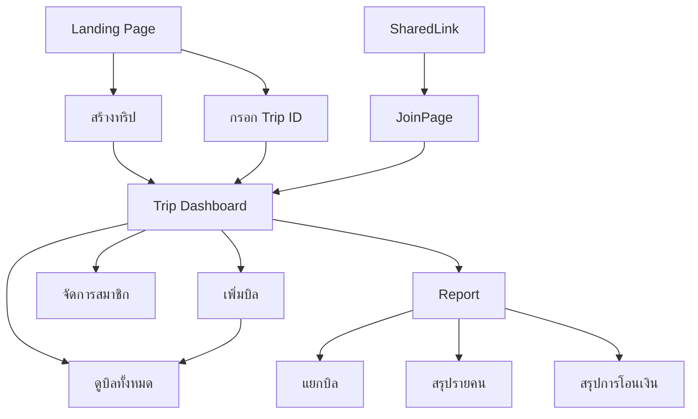

# Trip Expense Splitter — Full Specification

## ภาพรวมระบบ

ระบบคำนวณรายจ่ายต่อคนสำหรับการเดินทางท่องเที่ยว (Trip) โดยใช้หลักการหารเท่ากันทุกคน (Equal Split) แต่ในแต่ละรายการค่าใช้จ่ายสามารถกำหนดได้ว่าใครบ้างที่ร่วมหารในบิลนั้น

---

## Core Concepts

| แนวคิด | คำอธิบาย |
|--------|-----------|
| **Trip** | การเดินทางหนึ่งครั้ง มีผู้เข้าร่วม (Members) และรายการค่าใช้จ่าย (Bills) |
| **Member** | คนที่อยู่ในทริป ไม่ต้องมีบัญชีผู้ใช้ก็ได้ |
| **Bill** | รายการค่าใช้จ่ายหนึ่งรายการ มีผู้จ่าย (Payer) และผู้หาร (Participants) |
| **Split** | การหารค่าใช้จ่ายเท่ากันในบิลนั้น ๆ |

---

## หน้าทั้งหมดในระบบ

```
/                     → Landing Page
/trips/new            → Create Trip
/trips/[id]           → Trip Overview (Dashboard)
/trips/[id]/bills     → Bill List
/trips/[id]/bills/new → Add Bill
/trips/[id]/bills/[billId] → Bill Detail / Edit
/trips/[id]/members   → Manage Members
/trips/[id]/report    → Report & Summary
/trips/[id]/join      → Join Page (จาก shared link)
```

---

## 1. Landing Page (`/`)

### วัตถุประสงค์
จุดเริ่มต้นของผู้ใช้ที่ยังไม่มีทริป

### UI Elements
- ชื่อและคำอธิบายระบบสั้น ๆ
- ปุ่ม **"สร้างทริปใหม่"** → ไปหน้า `/trips/new`
- ช่องกรอก Trip ID พร้อมปุ่ม **"เข้าร่วมทริป"** → ไปหน้า `/trips/[id]`

---

## 2. Create Trip Page (`/trips/new`)

### วัตถุประสงค์
สร้างทริปใหม่และกำหนดรายชื่อผู้เข้าร่วมเริ่มต้น

### ฟอร์ม
| ฟิลด์ | ประเภท | Required | หมายเหตุ |
|-------|--------|----------|----------|
| ชื่อทริป | Text | ✅ | เช่น "เชียงใหม่ มี.ค. 68" |
| วันที่เดินทาง | Date Range | ❌ | optional |
| รายชื่อผู้เข้าร่วม | List | ✅ | ต้องมีอย่างน้อย 1 คน |

### Actions — รายชื่อผู้เข้าร่วม
- **เพิ่มชื่อ**: กรอกชื่อแล้วกด Enter หรือปุ่ม "+"
- **ลบชื่อ**: กดไอคอน × ข้างชื่อ
- **แก้ไขชื่อ**: กด inline edit ชื่อได้

### Action หลัก
- ปุ่ม **"สร้างทริป"** → validate → สร้าง Trip → redirect ไป `/trips/[id]`
- ปุ่ม **"ยกเลิก"** → กลับหน้า `/`

### Validation
- ชื่อทริปต้องไม่ว่าง
- ต้องมีผู้เข้าร่วมอย่างน้อย 1 คน
- ชื่อสมาชิกต้องไม่ซ้ำกันใน trip เดียวกัน

### Result
- สร้าง Trip พร้อม unique `trip_id` (เช่น `ABC-1234`)
- บันทึก `owner_session` ใน localStorage/cookie สำหรับ session ของผู้สร้าง

---

## 3. Trip Overview — Dashboard (`/trips/[id]`)

### วัตถุประสงค์
หน้าหลักของทริป แสดงข้อมูลสรุปและ navigation ไปส่วนต่าง ๆ

### ข้อมูลที่แสดง
- ชื่อทริป + วันที่ (ถ้ามี)
- Trip ID และปุ่ม **"Copy Link"** / **"Share"**
- จำนวนสมาชิก
- จำนวนบิลทั้งหมด
- ยอดรวมค่าใช้จ่าย
- Card สรุปหนี้รายคน (ยอดย่อ — ดูเต็มได้ที่ Report)

### Navigation Cards / Buttons
- **"บิลทั้งหมด"** → `/trips/[id]/bills`
- **"เพิ่มบิล"** → `/trips/[id]/bills/new`
- **"สมาชิก"** → `/trips/[id]/members`
- **"Report สรุป"** → `/trips/[id]/report`

### Share Trip
- แสดง Trip ID ขนาดใหญ่ให้อ่านง่าย
- ปุ่ม Copy Link → copy URL `/trips/[id]/join` ไปยัง clipboard
- รองรับ share ผ่าน Web Share API (บนมือถือ)

---

## 4. Manage Members Page (`/trips/[id]/members`)

### วัตถุประสงค์
จัดการรายชื่อสมาชิกในทริป

### ข้อมูลที่แสดง
- รายชื่อสมาชิกทั้งหมด พร้อมจำนวนบิลที่เกี่ยวข้อง

### Actions
| Action | เงื่อนไข | ผลลัพธ์ |
|--------|---------|---------|
| **เพิ่มสมาชิก** | กรอกชื่อ → กด "เพิ่ม" | เพิ่ม member ใหม่ บิลเก่าไม่ได้รับผลกระทบ |
| **แก้ไขชื่อ** | กด edit ข้างชื่อ | เปลี่ยนชื่อ display เฉพาะ — ไม่กระทบประวัติบิล |
| **ลบสมาชิก** | กด × | ได้เฉพาะสมาชิกที่ยังไม่มีบิลใด ๆ เกี่ยวข้อง |

### กฎสำคัญ
> สมาชิกที่มีบิลที่เกี่ยวข้องแล้ว (เป็น payer หรือ participant) **จะลบไม่ได้** แต่สามารถ "ซ่อน" ออกจากการเลือกใน bill ใหม่ได้ (soft-disable)

> การ **เพิ่ม/ลบ/แก้ไข** สมาชิก **ไม่มีผลย้อนหลัง** ต่อบิลที่บันทึกไปแล้ว

---

## 5. Bill List Page (`/trips/[id]/bills`)

### วัตถุประสงค์
แสดงรายการบิลทั้งหมดในทริป

### ข้อมูลที่แสดง (ต่อ 1 บิล)
- ชื่อบิล
- ยอดเงิน
- ผู้จ่าย (Payer)
- จำนวนคนที่หาร
- วันที่บันทึก

### Actions
- ปุ่ม **"+ เพิ่มบิล"** → `/trips/[id]/bills/new`
- กดที่บิล → `/trips/[id]/bills/[billId]` (ดูรายละเอียด / แก้ไข)
- **ลบบิล** (Swipe หรือปุ่ม ×) → confirm dialog → ลบ

### Sorting / Filter (optional)
- เรียงตามวันที่ (ล่าสุดก่อน)
- Filter ตามสมาชิก

---

## 6. Add / Edit Bill Page (`/trips/[id]/bills/new` และ `/trips/[id]/bills/[billId]`)

### วัตถุประสงค์
เพิ่มหรือแก้ไขรายการค่าใช้จ่าย

### ฟอร์ม
| ฟิลด์ | ประเภท | Required | หมายเหตุ |
|-------|--------|----------|----------|
| ชื่อรายการ | Text | ✅ | เช่น "ค่าที่พัก", "ค่าอาหารเย็น" |
| จำนวนเงิน | Number | ✅ | ทศนิยม 2 ตำแหน่ง |
| สกุลเงิน | Select | ✅ | default: THB |
| ผู้จ่าย (Payer) | Select | ✅ | เลือกจาก member list |
| ผู้ร่วมหาร | Multi-select | ✅ | checkbox รายชื่อ, default = เลือกทุกคน |
| วันที่ | Date | ❌ | default = วันนี้ |
| หมายเหตุ | Textarea | ❌ | |

### การเลือกผู้ร่วมหาร
- แสดง checkbox list ของสมาชิกทุกคน
- มีปุ่ม **"เลือกทั้งหมด"** / **"ล้างทั้งหมด"**
- Preview แสดงยอดต่อคน = `จำนวนเงิน ÷ จำนวนคนที่เลือก` แบบ realtime

### Validation
- ชื่อรายการต้องไม่ว่าง
- จำนวนเงินต้องมากกว่า 0
- ต้องเลือกผู้ร่วมหารอย่างน้อย 1 คน
- ต้องเลือก Payer

### Actions
- **"บันทึก"** → save → กลับหน้า Bill List
- **"ยกเลิก"** → กลับหน้าก่อนหน้า
- (Edit mode) **"ลบบิลนี้"** → confirm dialog → ลบ → กลับ Bill List

---

## 7. Join Page (`/trips/[id]/join`)

### วัตถุประสงค์
หน้า landing สำหรับผู้ที่เปิด shared link

### ข้อมูลที่แสดง
- ชื่อทริป
- รายชื่อสมาชิก
- จำนวนบิล + ยอดรวม
- ปุ่ม **"เข้าร่วมทริปนี้"** → redirect ไป `/trips/[id]`

> หน้านี้ไม่ต้องการ login — ใครก็เข้าดูและเพิ่มข้อมูลได้ถ้ามี trip id

---

## 8. Report Page (`/trips/[id]/report`)

### วัตถุประสงค์
สรุปรายจ่ายทั้งหมดและแสดงว่าแต่ละคนต้องจ่ายอะไรบ้าง

---

### 8.1 รายการแยกบิล (Bill Breakdown)

แต่ละบิลแสดง:
- ชื่อบิล + ยอดรวม
- ผู้จ่าย (Payer)
- ตาราง: รายชื่อคนที่ร่วมหาร | ยอดต่อคน

**ตัวอย่าง:**

```
🧾 ค่าที่พัก — 3,000 บาท (จ่ายโดย: นาย)
┌──────────┬───────────┐
│ ชื่อ    │ ยอดที่ต้องหาร │
├──────────┼───────────┤
│ นาย      │ 1,000 บาท │
│ สมชาย    │ 1,000 บาท │
│ สมหญิง   │ 1,000 บาท │
└──────────┴───────────┘
```

---

### 8.2 สรุปรายคน (Per-Person Summary)

แสดงสำหรับ **ทุกคน** ในทริป:

```
👤 นาย
  จ่ายแทนไป:   5,000 บาท
  ส่วนแบ่งของตัวเอง: 2,500 บาท
  ────────────────────────────
  ยอดที่ควรได้รับคืน: +2,500 บาท   ✅ (คนอื่นติดหนี้นาย)

👤 สมชาย
  จ่ายแทนไป:   0 บาท
  ส่วนแบ่งของตัวเอง: 2,000 บาท
  ────────────────────────────
  ยอดที่ต้องจ่าย: -2,000 บาท   ❗
```

---

### 8.3 สรุปการโอนเงิน (Settlement Summary)

คำนวณว่าใครต้องโอนเงินให้ใครบ้าง เพื่อให้ทุกคนเสมอกัน

```
💸 สมชาย → นาย: 2,000 บาท
💸 สมหญิง → นาย: 500 บาท
```

> อัลกอริทึม: Minimize number of transactions (Greedy debt settlement)

---

### Actions ในหน้า Report
- ปุ่ม **"Export เป็น PDF"** / **"Share Report"** (ผ่าน Web Share API)
- ปุ่ม filter: แสดงเฉพาะบิลของคน X
- Toggle ระหว่าง แยกบิล / สรุปรายคน / สรุปการโอนเงิน

---

## Business Logic & Rules

### การคำนวณ Split
```
ยอดต่อคน = ROUND(ยอดรวมบิล / จำนวนคนที่ร่วมหาร, 2)
```

หากมีเศษ (rounding difference) → กระจายให้คนแรก ๆ ในรายการ (standard banker approach)

### Balance ของแต่ละคน
```
balance = Σ(บิลที่ตัวเองจ่าย) - Σ(ส่วนแบ่งที่ตัวเองต้องหาร)
```
- balance > 0 → คนอื่นติดหนี้ (ควรได้รับเงิน)
- balance < 0 → ตัวเองติดหนี้ (ต้องจ่ายเงิน)
- balance = 0 → เสมอกัน

### Immutability ของบิล
เมื่อสร้างบิลแล้ว snapshot ของ participants จะถูกบันทึกไว้ใน bill นั้น ดังนั้นการเพิ่ม/ลบสมาชิกในภายหลังจะ **ไม่กระทบ** บิลเก่า

---

## Data Model (Conceptual)

### Trip
```json
{
  "id": "ABC-1234",
  "name": "เชียงใหม่ มี.ค. 68",
  "startDate": "2025-03-01",
  "endDate": "2025-03-04",
  "createdAt": "2025-02-20T10:00:00Z"
}
```

### Member
```json
{
  "id": "m_001",
  "tripId": "ABC-1234",
  "name": "นาย",
  "active": true,
  "createdAt": "2025-02-20T10:00:00Z"
}
```

### Bill
```json
{
  "id": "b_001",
  "tripId": "ABC-1234",
  "title": "ค่าที่พัก",
  "amount": 3000.00,
  "currency": "THB",
  "payerId": "m_001",
  "participants": ["m_001", "m_002", "m_003"],
  "date": "2025-03-01",
  "note": "",
  "createdAt": "2025-03-01T20:00:00Z"
}
```

> `participants` เป็น snapshot ณ เวลาที่สร้างบิล

---

## UX / Non-Functional Requirements

| หัวข้อ | รายละเอียด |
|--------|-----------|
| **No Login Required** | เข้าใช้งานได้ทันทีผ่าน trip_id ไม่ต้องสมัครบัญชี |
| **Session Persistence** | บันทึก trip_id ที่เคยเข้าใช้ไว้ใน localStorage |
| **Mobile First** | ออกแบบหลักสำหรับมือถือ, รองรับ desktop |
| **Offline Draft** | (optional) draft bill บันทึก local ก่อน sync |
| **Real-time** | (optional) หลาย user เพิ่มบิลพร้อมกันได้ |
| **Share** | รองรับ Web Share API + copy-to-clipboard |
| **Accessibility** | contrast ratio ผ่าน WCAG AA, label ครบ |

---

## Edge Cases

| กรณี | การจัดการ |
|------|-----------|
| บิลที่มีคนหารคนเดียว | ยอดเต็มตกไปที่คนนั้น — ถ้าเป็น payer ด้วย balance = 0 |
| ลบสมาชิกที่มีบิล | ไม่อนุญาต — ต้องลบบิลที่เกี่ยวข้องก่อน หรือ soft-disable |
| Trip ไม่มีบิลเลย | Report แสดง "ยังไม่มีรายการ" |
| เพิ่มสมาชิกหลังมีบิลแล้ว | สมาชิกใหม่ไม่ถูกเพิ่มเข้าบิลเก่าอัตโนมัติ |
| ยอดเงินเป็น 0 | ไม่อนุญาตบันทึก |
| Trip ID ไม่มีในระบบ | แสดงหน้า 404 + ปุ่มสร้างทริปใหม่ |

---

## User Flow สรุป


